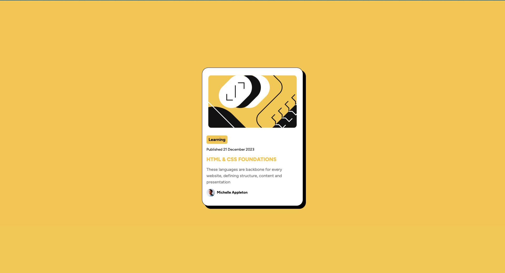
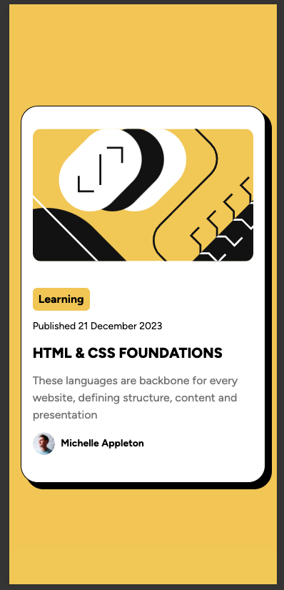

# Frontend Mentor - Blog preview card solution

This is a solution to the [Blog preview card challenge on Frontend Mentor](https://www.frontendmentor.io/challenges/blog-preview-card-ckPaj01IcS). Frontend Mentor challenges help you improve your coding skills by building realistic projects.

## Table of contents

- [Overview](#overview)
  - [The challenge](#the-challenge)
  - [Screenshot](#screenshot)
  - [Links](#links)
- [My process](#my-process)
  - [Built with](#built-with)
- [Author](#author)
- [Acknowledgments](#acknowledgments)

## Overview

### The challenge

Users should be able to:

- See hover and focus states for all interactive elements on the page

### Screenshot

### Links

- [Solution URL](https://github.com/LEstebanR/FM_blog_preview_card)
- [Live Site URL](https://fm-blog-preview-card-kappa.vercel.app/)

## My process

### Built with

- [React](https://reactjs.org/) - JS library
- [Vite](https://vitejs.dev/) - React framework
- [Tailwind](https://tailwindcss.com/) - For styles

## Author

- Website - [LEsteban](https://www.lesteban.dev/)
- Frontend Mentor - [@LEstebanR](https://www.frontendmentor.io/profile/LEstebanR)

## Acknowledgments

Thank you fontend Mentor, nice design!
